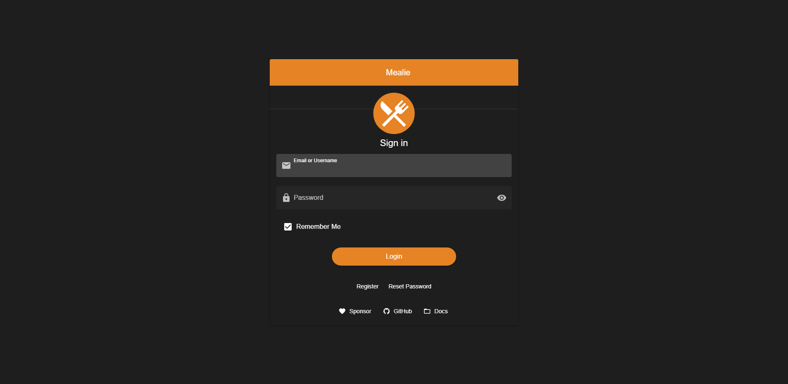
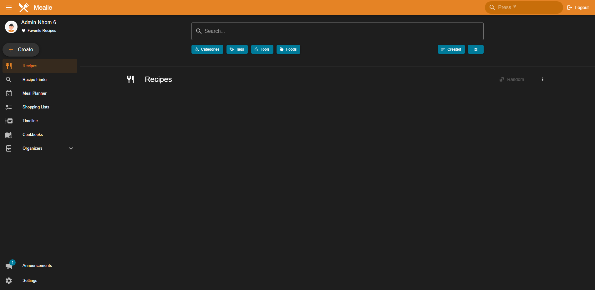
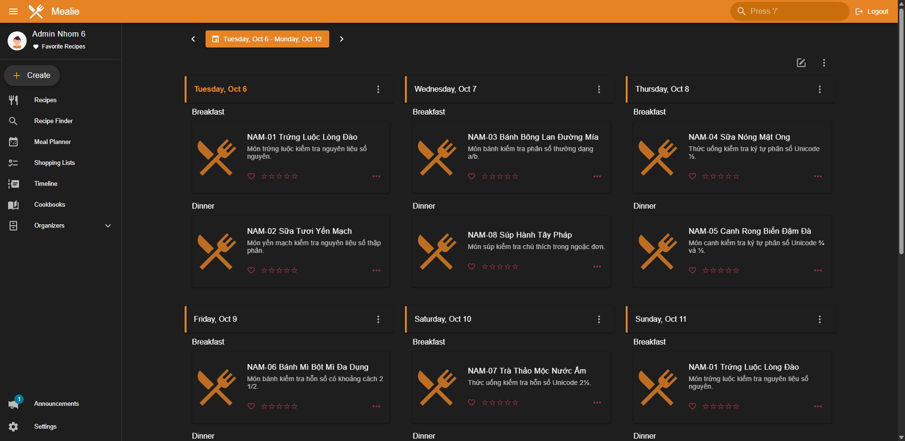
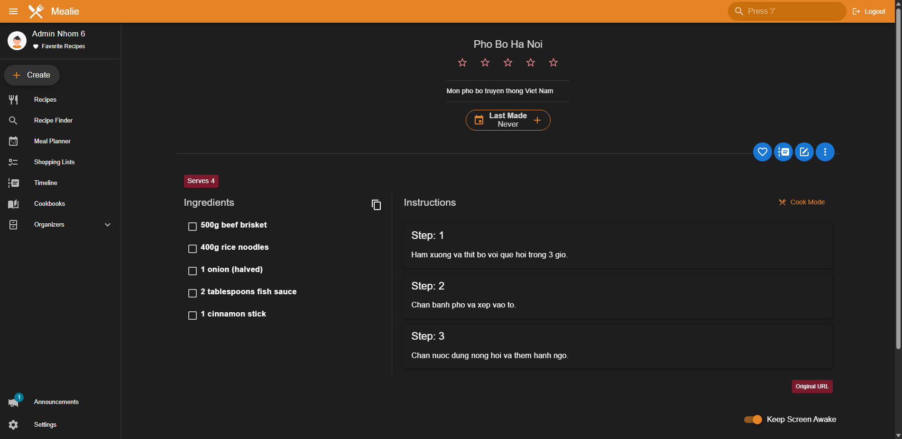
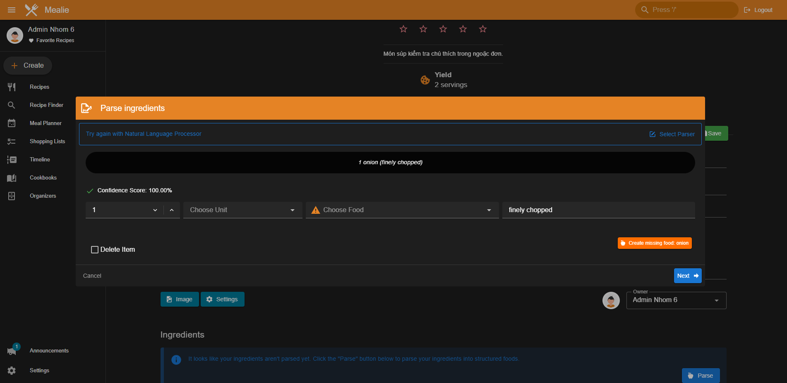
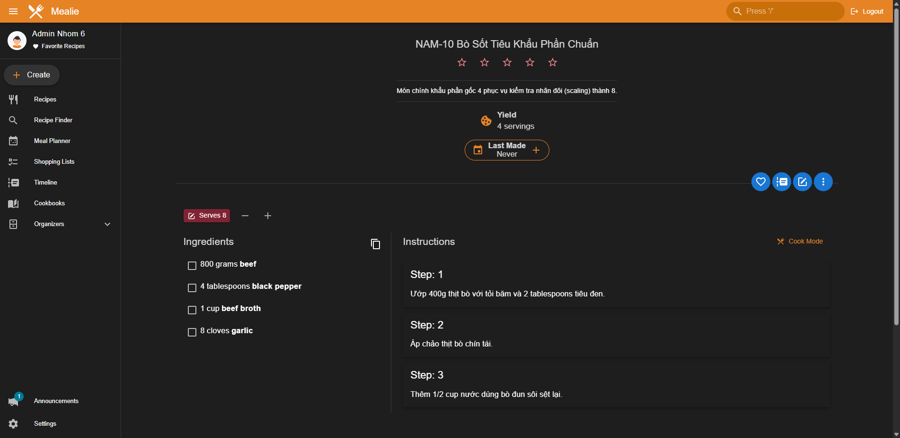

# PHẦN C — HƯỚNG DẪN CÀI ĐẶT & VẬN HÀNH MÔI TRƯỜNG KIỂM THỬ

**Đồ án: Kiểm thử Phần mềm — Nhóm 6**
**Hệ thống: Mealie v3.28.0 (Recipe Manager & Meal Planner)**
**Người thực hiện: Nguyễn Phạm Phú Nam — Vai trò: DevOps & Automation QA**
**Môi trường đã kiểm chứng: Windows 11 + Docker Desktop**

---

## C.1 — Yêu cầu môi trường

### Hệ điều hành và môi trường máy thật đã kiểm chứng

| Thành phần | Phiên bản máy thật đã kiểm chứng | Ghi chú kỹ thuật |
|---|---|---|
| Hệ điều hành | Windows 11 Home Single Language (Build 26300) | Môi trường máy trạm thực tế của thành viên |
| Docker Engine | 29.7.2 (Client & Server) | Đi kèm Docker Desktop 29.7.2 (WSL 2 backend) |
| Docker Compose | v5.5.1 | Docker Compose v2 plugin |
| Git | 2.55.0.windows.3 | Quản lý mã nguồn và nhánh GitHub |
| Python (Host) | Python 3.14.7 | Môi trường ảo `.venv` chạy script seed & test trên host |
| Python (Container) | Python 3.14.8 (`python:3.14-slim`) | Base image chuẩn của Mealie v3.28.0 và Test Runner |

> **Lưu ý Linux:** Nếu dùng Linux, thay `host.docker.internal` trong `HTTP_ALLOW_LIST` bằng địa chỉ IP cầu nội bộ Docker (`172.17.0.1` hoặc output của `ip route | grep default | awk '{print $3}'`). Cấu hình này chưa được kiểm chứng trong dự án.

### Phiên bản Mealie đã pin

- **Tag:** `v3.28.0`
- **Source SHA:** `0552eaa4a80031b8572849cca0ed95d07f1be001`
- **Image:** `ghcr.io/mealie-recipes/mealie:v3.28.0`
- **Ngày chốt:** 06/10/2026

### Cổng sử dụng

| Dịch vụ | Cổng host | Cổng container | Mục đích |
|---|---|---|---|
| Mealie Web UI | **9925** | 9000 | Giao diện chính |
| Mock Recipe Server | **9926** | 9926 | Server công thức mẫu cho import URL |

Đảm bảo hai cổng trên **không bị chiếm** trước khi khởi động.

### Tài khoản demo & Quản trị

| Loại | Email | Mật khẩu | Mục đích |
|---|---|---|---|
| Default Admin (gốc Mealie) | `changeme@example.com` | `MyPassword` | Tài khoản khởi tạo mặc định của image Mealie v3.28.0 |
| Team Admin (Quản trị viên nhóm) | `admin@nhom6.test` | `Admin123@` | Tài khoản quản trị đồ án (tạo qua Admin Panel hoặc Register) |
| Người dùng thường | `test@nhom6.test` | `User123@` | Kiểm thử quyền hạn người dùng thông thường |

> Image gốc Mealie v3.28.0 tự động khởi tạo tài khoản quản trị mặc định `changeme@example.com` / `MyPassword`. Sau khi đăng nhập lần đầu, quản trị viên có thể vào Admin Panel tạo tài khoản nhóm `admin@nhom6.test` hoặc đổi mật khẩu (xem chi tiết C.2 Bước 5).

---

## C.2 — Cài đặt chi tiết

### Bước 1: Clone repo đúng nhánh

```powershell
# Clone repo nhóm
git clone https://github.com/2312726-collab/KTPM-nhom6-K02-R01.git
cd KTPM-nhom6-K02-R01

# Chuyển vào nhánh tương ứng của nhóm N cần thao tác:
# - N1 (Docker Mealie): git checkout 2312695-NguyenPhamPhuNam-N1-Docker
# - N2 (Seed Data & Flows): git checkout 2312695-NguyenPhamPhuNam-N2-SeedData
# - N3 (Báo cáo On-boarding Phần C): git checkout 2312695-NguyenPhamPhuNam-N3-PhanC
# - N4 (PBT Property 5 & Runner): git checkout 2312695-NguyenPhamPhuNam-N4-Property5
# Hoặc nhánh tích hợp tổng hợp công việc của Nam:
git checkout feat/nam-property-5-fraction
```

### Bước 2: Tạo file `.env` từ mẫu

```powershell
# Từ thư mục gốc repo, chuyển vào thư mục mealie_docker
cd mealie_docker

# Sao chép mẫu cấu hình
Copy-Item .env.example .env
```

Nội dung mặc định của `.env`:

```env
MEALIE_PORT=9925
ALLOW_SIGNUP=true
BASE_URL=http://localhost:9925
LOG_LEVEL=DEBUG
DB_ENGINE=sqlite
HTTP_ALLOW_LIST=host.docker.internal
```

> `.env` là file local, **không được commit** vào Git.

### Bước 3: Khởi động Mealie bằng Docker Compose

```powershell
# Tiếp tục thực thi trong thư mục mealie_docker/ (đã cd từ Bước 2, không cd lần hai)
# Khởi động container ở chế độ nền
docker compose up -d

# (Lưu ý: Chỉ chạy 'cd mealie_docker' nếu đang mở một terminal mới tại thư mục gốc repo)

# Kiểm tra container đang chạy
docker compose ps
```

Kết quả mong đợi:
```
NAME      IMAGE                                    STATUS    PORTS
mealie    ghcr.io/mealie-recipes/mealie:v3.28.0   running   0.0.0.0:9925->9000/tcp
```

### Bước 4: Kiểm tra log và trạng thái khởi động

```powershell
# Xem log khởi động (Ctrl+C để thoát)
docker compose logs -f mealie
```

Chờ xuất hiện dòng `Application startup complete` hoặc `Uvicorn running on` trước khi tiếp tục. Thường mất 15–30 giây.

### Bước 5: Truy cập và cấu hình Admin

Mở trình duyệt: **http://localhost:9925**



*Hình C.2.1 — Giao diện trang chủ Mealie lần đầu truy cập*

Mealie v3.28.0 hỗ trợ hai cách cấu hình Quản trị viên:

#### Cách 1: Đăng nhập bằng tài khoản mặc định Mealie (Khuyến nghị)
1. Nhấn **Login** ở góc trên phải.
2. Đăng nhập với thông tin mặc định:
   - **Email / Username:** `changeme@example.com`
   - **Password:** `MyPassword`
3. Sau khi vào hệ thống:
   - Điều hướng tới **Admin Panel** (`/admin/manage/users`).
   - Nhấn **Create User** để tạo tài khoản Quản trị viên nhóm:
     - **Email:** `admin@nhom6.test`
     - **Username:** `admin`
     - **Password:** `Admin123@`
     - Bật quyền **Admin**.
   - (Khuyến nghị bảo mật) Đổi mật khẩu hoặc vô hiệu hóa tài khoản mặc định `changeme@example.com`.

#### Cách 2: Đăng ký tài khoản đầu tiên qua `/register`
Nếu trong `.env` có `ALLOW_SIGNUP=true`:
1. Nhấn **Get Started** hoặc truy cập `http://localhost:9925/register`.
2. Điền:
   - **Email:** `admin@nhom6.test`
   - **Username:** `admin`
   - **Password:** `Admin123@`
   - **Confirm Password:** `Admin123@`
3. Nhấn **Create Account**.
4. Đăng nhập bằng tài khoản `changeme@example.com` vào **Admin Panel** → **Manage Users** để xác nhận hoặc cấp quyền Admin cho `admin@nhom6.test`.

Sau khi đăng nhập Admin, Dashboard hiển thị:



*Hình C.2.2 — Dashboard Mealie sau khi Admin đăng nhập thành công*

### Bước 6: Cài đặt môi trường Python cho seed/test

Từ **thư mục gốc repo**:

```powershell
# Tạo virtual environment
python -m venv .venv

# Kích hoạt (Windows PowerShell)
.\.venv\Scripts\Activate.ps1

# Nếu bị lỗi execution policy:
Set-ExecutionPolicy -ExecutionPolicy RemoteSigned -Scope CurrentUser

# Cài dependencies kiểm thử
pip install -r requirements-test.txt
```

---

## C.3 — Quản lý dịch vụ Docker

### Lệnh thường dùng

```powershell
# Phải đứng trong mealie_docker/ cho các lệnh compose
cd mealie_docker

# Khởi động (chế độ nền)
docker compose up -d

# Xem trạng thái container
docker compose ps

# Xem log realtime
docker compose logs -f mealie

# Xem log 100 dòng cuối
docker compose logs --tail=100 mealie

# Dừng container (giữ nguyên dữ liệu)
docker compose stop

# Dừng và xóa container (giữ volume dữ liệu)
docker compose down

# Restart container hiện có (Lưu ý: KHÔNG nạp biến môi trường mới)
docker compose restart mealie
```

### Áp dụng thay đổi biến môi trường Docker

> ⚠️ **LƯU Ý CỐT LÕI VỀ BIẾN MÔI TRƯỜNG:**
> Lệnh `docker compose restart mealie` CHỈ khởi động lại tiến trình bên trong container đang chạy. Lệnh này **KHÔNG** đọc lại các thay đổi trong file `.env` hoặc phần `environment` của `docker-compose.yml`.
>
> Khi thay đổi bất kỳ biến môi trường nào (ví dụ thêm `HTTP_ALLOW_LIST=host.docker.internal` hoặc đổi cổng `MEALIE_PORT`), bắt buộc phải thực thi:
> ```powershell
> docker compose up -d
> ```
> Docker Compose sẽ tự động so sánh cấu hình, nhận diện thay đổi và tái tạo (recreate) container với cấu hình môi trường mới, đồng thời gắn lại named volume `mealie-data` nên toàn bộ dữ liệu vẫn được bảo toàn nguyên vẹn.

### Named Volume và bảo toàn dữ liệu

Cấu hình trong `docker-compose.yml`:

```yaml
volumes:
  - mealie-data:/app/data/
```

Toàn bộ dữ liệu Mealie (công thức, thực đơn, tài khoản) được lưu trong **named volume** `mealie-data`. Volume này **tồn tại độc lập** với container:

| Lệnh | Tác động lên container | Tác động lên dữ liệu |
|---|---|---|
| `docker compose stop` | Container dừng | **Giữ nguyên** |
| `docker compose down` | Container + network bị xóa | **Giữ nguyên** |
| `docker compose up -d` | Tạo container mới | Nhận lại volume cũ |
| `docker compose down -v` | Container + network bị xóa | **XÓA TOÀN BỘ** |

> ⚠️ **KHÔNG chạy** `docker compose down -v` hoặc `docker volume rm mealie-data` như thao tác dừng thường lệ.

```powershell
# Xem danh sách volume
docker volume ls | findstr mealie
```

---

## C.4 — Seed Data và ba luồng nghiệp vụ cốt lõi

### Chuẩn bị

Đảm bảo:
1. Container Mealie đang chạy (`docker compose ps` → status `running`)
2. Tài khoản Admin `admin@nhom6.test` đã tạo (xem C.2 Bước 5)
3. Virtual environment đã kích hoạt (xem C.2 Bước 6)

Seed script đọc thông tin đăng nhập qua biến môi trường (mặc định dùng Admin):

| Biến | Giá trị mặc định | Ý nghĩa |
|---|---|---|
| `MEALIE_BASE_URL` | `http://localhost:9925` | URL Mealie |
| `MEALIE_EMAIL` | `admin@nhom6.test` | Tài khoản đăng nhập |
| `MEALIE_PASSWORD` | `Admin123@` | Mật khẩu |

### Chạy seed data

Từ thư mục gốc repo (`.venv` đã kích hoạt):

```powershell
# Chạy seed (idempotent — chạy lại không tạo trùng)
& ".\.venv\Scripts\python.exe" mealie_docker/seed/seed_data.py
```

Kết quả mong đợi:

```
Logging in to http://localhost:9925 as admin@nhom6.test...
Processing recipe: [NAM-01] Cháo Yến Mạch Sáng...
  -> Created with slug: nam-01-chao-yen-mach-sang
...
Processing recipe: [NAM-10] Bò Xào Tiêu Đen Scaling Test...
  -> Created with slug: nam-10-bo-xao-tieu-den-scaling-test
Setting up 7-day Meal Plan (06/10/2026 - 12/10/2026)...
  -> Created meal plan on 2026-10-06 (breakfast): Bữa sáng ngày 06/10
...
Seed data completed successfully!
```

### Kiểm tra kết quả seed

**Tài khoản người dùng thường (đã chuẩn bị ở N2.1.1):**

Tài khoản `test@nhom6.test` / `User123@` đã được khởi tạo trong bước chuẩn bị N2.1.1 qua **Admin Panel** (`/admin/manage/users`). Script `seed_data.py` tập trung tự động hóa nạp công thức và thực đơn, không can thiệp hay tạo trùng tài khoản người dùng để đảm bảo tính an toàn dữ liệu.

**10 công thức NAM-01 đến NAM-10 (do seed script nạp):**

Vào **Recipes** → kiểm tra danh sách 10 công thức có tiền tố `[NAM-01]` đến `[NAM-10]` đã được nạp tự động thành công.

**Thực đơn 7 ngày:**

Vào **Meal Planner** → điều hướng đến tuần **06/10–12/10/2026** → xác nhận 14 bữa (2 bữa mỗi ngày: sáng + tối).



*Hình C.4.1 — Thực đơn 7 ngày tuần 06/10–12/10/2026 sau khi seed*

### Luồng 1 — Import công thức từ URL

Nhóm cung cấp server mẫu phục vụ công thức định dạng JSON-LD trên cổng **9926**.

**Bước 1:** Khởi động server mẫu (terminal riêng, giữ mở):

```powershell
# Terminal riêng, từ thư mục gốc repo
& ".\.venv\Scripts\python.exe" mealie_docker/seed/mock_recipe_server.py
```

Server chạy tại `http://localhost:9926`. Kiểm tra từ host:

```powershell
Invoke-WebRequest http://localhost:9926/recipe/pho-bo -UseBasicParsing | Select-Object StatusCode
```

**Bước 2:** Import trong Mealie UI:

1. Đăng nhập Mealie → **Recipes** → **Create** → **Import from URL**
2. Điền URL: `http://host.docker.internal:9926/recipe/pho-bo`
   - Container dùng `host.docker.internal` để trỏ về host (không phải `localhost`)
3. Nhấn **Import**

Kết quả: Công thức `Phở Bò Hà Nội` được tạo với 5 nguyên liệu, 3 bước và khẩu phần 4.



*Hình C.4.2 — Công thức `pho-bo-ha-noi` đã import thành công từ mock server*

### Luồng 2 — Phân tích nguyên liệu (Ingredient Parsing)

1. Mở bất kỳ công thức → **Edit** → phần **Ingredients**
2. Nhấn **Parse All** hoặc nhập nguyên liệu và nhấn **Parse**
3. Nhập chuỗi: `1 onion (finely chopped)`

Kết quả parser bóc tách:

| Trường | Giá trị |
|---|---|
| Qty | 1 |
| Unit | (trống — không xác định đơn vị) |
| Food | onion |
| Note | finely chopped |



*Hình C.4.3 — Parser bóc tách `1 onion (finely chopped)` thành Qty=1, Food=onion, Note=finely chopped*

### Luồng 3 — Nhân tỉ lệ khẩu phần (Servings Scaling)

Sử dụng công thức **NAM-10** (`Bò Xào Tiêu Đen Scaling Test`) — được thiết kế với Food/Unit phù hợp.

1. Mở công thức NAM-10
2. Tại trường **Servings**, đổi từ **4** thành **8** (nhân đôi)
3. Mealie tự động nhân đôi tất cả lượng nguyên liệu:

| Nguyên liệu | Gốc (4 servings) | Sau scaling (8 servings) |
|---|---|---|
| Beef | 400g | 800g |
| Black pepper | 2 tbsp | 4 tbsp |
| Beef broth | 1/2 cup | 1 cup |
| Garlic | 4 cloves | 8 cloves |



*Hình C.4.4 — NAM-10 scale từ 4 lên 8 servings — tất cả nguyên liệu nhân đôi chính xác*

---

## C.5 — Xử lý sự cố thường gặp

### Lỗi 1: Xung đột cổng (Port Conflict)

**Triệu chứng:**
```
Error response from daemon: Ports are not available:
  address already in use 0.0.0.0:9925
```

**Xử lý:**

```powershell
# Tìm tiến trình đang dùng cổng 9925
netstat -ano | findstr :9925

# Xem PID (cột cuối) rồi kill
taskkill /PID <PID> /F
```

Hoặc đổi cổng trong `mealie_docker/.env`:
```env
MEALIE_PORT=9930
BASE_URL=http://localhost:9930
```

Nếu cổng 9926 bị chiếm, đổi biến `PORT = 9926` trong `mock_recipe_server.py`.

### Lỗi 2: Quyền thư mục / Volume permission

**Triệu chứng:** Container không ghi được vào `/app/data/` hoặc dữ liệu không lưu.

**Xử lý:**
```powershell
# Kiểm tra volume
docker volume inspect mealie-data

# Nếu bị lỗi, tạo lại (CHỈ dùng trên máy cài mới — XÓA DỮ LIỆU)
docker compose down
docker volume rm mealie-data
docker compose up -d
```

### Lỗi 3: Docker Daemon chưa khởi động

**Triệu chứng:**
```
error during connect: This error may indicate that the docker daemon is not running.
```

**Xử lý:**
1. Mở **Docker Desktop** từ Start Menu
2. Chờ icon Docker ở taskbar ổn định (không còn spinning)
3. Chạy lại `docker compose up -d`

### Lỗi 4: Không đăng nhập được Mealie

**Triệu chứng:** Trang đăng nhập báo lỗi dù nhập đúng email/password.

**Xử lý:**
```powershell
# Kiểm tra container đang chạy
docker compose ps

# Xem log
docker compose logs --tail=50 mealie

# Thử restart container
docker compose restart mealie
```

Nếu tài khoản `admin@nhom6.test` chưa được tạo: Hãy đăng nhập bằng tài khoản mặc định `changeme@example.com` / `MyPassword` và cấu hình tài khoản theo mục C.2 Bước 5.

### Lỗi 5: Container không truy cập được mock server

**Triệu chứng:** Import URL `http://host.docker.internal:9926/recipe/pho-bo` trả về lỗi kết nối trong Mealie.

**Kiểm tra:**
```powershell
# Xác nhận mock server đang chạy từ host
Invoke-WebRequest http://localhost:9926/recipe/pho-bo -UseBasicParsing | Select-Object StatusCode

# Xác nhận cấu hình HTTP_ALLOW_LIST
docker inspect mealie | findstr HTTP_ALLOW_LIST
```

**Nguyên nhân thường gặp:**
1. Mock server chưa khởi động — chạy `mock_recipe_server.py` trong terminal riêng và giữ mở.
2. `HTTP_ALLOW_LIST` thiếu trong `.env` — thêm `HTTP_ALLOW_LIST=host.docker.internal` vào file `mealie_docker/.env` rồi chạy `docker compose up -d` để recreate container nạp biến môi trường mới (lưu ý không dùng `docker compose restart` vì restart không nạp file `.env` mới).
3. Trên Linux: `host.docker.internal` không tự resolve — dùng IP cầu Docker (xem ghi chú C.1).

### Lỗi 6: Seed script báo lỗi đăng nhập

**Triệu chứng:**
```
RuntimeError: POST /api/auth/token failed: 401 - ...
```

**Xử lý:**
```powershell
# Ghi đè biến môi trường nếu cần
$env:MEALIE_BASE_URL = "http://localhost:9925"
$env:MEALIE_EMAIL = "admin@nhom6.test"
$env:MEALIE_PASSWORD = "Admin123@"

# Chạy lại seed
& ".\.venv\Scripts\python.exe" mealie_docker/seed/seed_data.py
```

### Lỗi 7: pytest thu thập 0 test

**Triệu chứng:**
```
collected 0 items
exit code 5
```

**Giải thích:** Ở thời điểm báo cáo này, file `tests/unit_tests/test_pbt_fraction.py` chưa được tạo (N4 đang thực hiện). Exit code **5** là bình thường, không phải lỗi môi trường.

Sau khi N4 hoàn thành:
```powershell
& ".\.venv\Scripts\python.exe" -m pytest tests/unit_tests/test_pbt_fraction.py --collect-only -q
& ".\.venv\Scripts\python.exe" -m pytest tests/unit_tests/test_pbt_fraction.py -v --tb=long
```

---

*Tài liệu do Nguyễn Phạm Phú Nam biên soạn — cập nhật: 07/10/2026*
*Môi trường kiểm chứng: Windows 11 + Docker Desktop + Mealie v3.28.0*