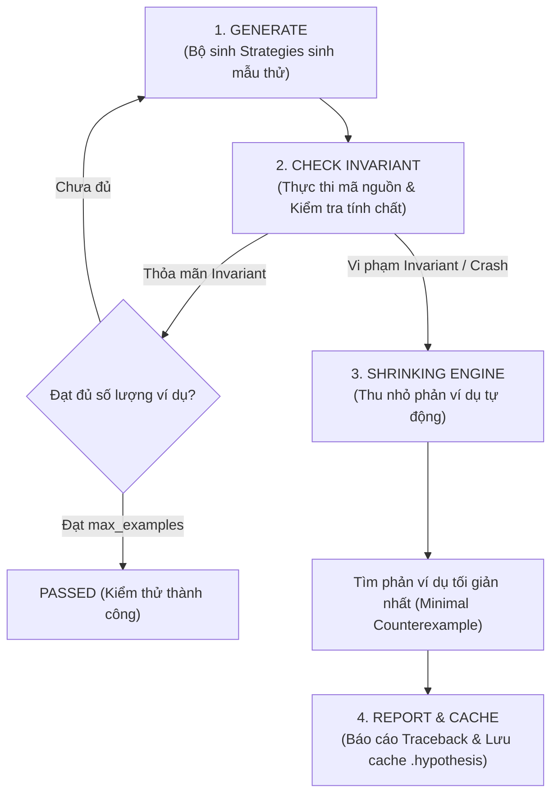

# PHẦN D: CƠ SỞ LÝ THUYẾT PROPERTY-BASED TESTING & PHƯƠNG PHÁP LUẬN KIỂM THỬ
## ĐỒ ÁN MÔN HỌC: KIỂM THỬ PHẦN MỀM — NHÓM 6
* **Hệ thống mục tiêu (Repo R02):** [Mealie v3.28.0](https://github.com/mealie-recipes/mealie)
* **Kỹ thuật kiểm thử (K01):** Property-Based Testing (PBT) với thư viện `Hypothesis`
* **Người thực hiện:** **Bùi Trung Hiếu** *(MSSV: 2312611 — Test Architect & PBT Methodology Specialist)*

---

### D.1. BẢN CHẤT CỦA PROPERTY-BASED TESTING VÀ SO SÁNH VỚI EXAMPLE-BASED TESTING

#### 1. Khái niệm cốt lõi
Kiểm thử dựa trên thuộc tính (**Property-Based Testing - PBT**) là một kỹ thuật kiểm thử tự động tiên tiến, trong đó kiểm thử viên không định nghĩa từng cặp giá trị đầu vào - đầu ra cụ thể $(x_i, y_i)$, mà xác định các **tính chất phổ quát (Universal Invariants)** mà phần mềm phải luôn thỏa mãn với mọi dữ liệu hợp lệ thuộc miền xác định (Domain):
$$\forall x \in \text{Domain}, \quad P(x) = \text{True}$$

Thay vì con người tự nghĩ ra một vài ca kiểm thử mẫu hữu hạn, công cụ PBT (trong dự án này là `Hypothesis`) sẽ tự động phát sinh hàng trăm đến hàng ngàn ca kiểm thử ngẫu nhiên có định hướng, tìm kiếm các phản ví dụ (Counterexamples / Falsifying examples) phá vỡ tính chất bất biến $P(x)$.

#### 2. Bảng so sánh đa tiêu chí: Example-Based Testing vs. Property-Based Testing

| Tiêu chí so sánh | Example-Based Testing (EBT truyền thống) | Property-Based Testing (PBT với Hypothesis) |
| :--- | :--- | :--- |
| **Bản chất kiểm tra** | Xác minh: $f(x_0) == y_0$ với $x_0, y_0$ cố định cụ thể. | Xác minh: $P(f(x)) == \text{True}$ với $\forall x \in \text{Domain}$. |
| **Không gian mẫu thử nghiệm** | Giới hạn (vài ca kiểm thử được hardcode thủ công). | Vô hạn (hàng trăm đến hàng ngàn ca thử ngẫu nhiên có cấu trúc). |
| **Phát hiện ca biên (Edge cases)** | Dễ bỏ sót do thiên kiến của lập trình viên (Confirmation Bias). | Tự động dò tìm: chuỗi rỗng, số 0, số âm, cực trị float, ký tự Unicode đặc biệt,... |
| **Cách tiếp cận phản ví dụ** | Khi lỗi xảy ra, mẫu thử thường cố định nhưng chưa chắc đã là ca biên nhỏ nhất. | Tự động **thu nhỏ lỗi (Shrinking)** về mẫu đơn giản nhất có thể tái hiện lỗi. |
| **Độ tin cậy và bao phủ** | Chỉ đảm bảo đúng trên các ca đã viết. | Chứng minh tính đúng đắn trên toàn bộ miền thuộc tính logic toán học. |
| **Chi phí bảo trì mã nguồn** | Phải viết nhiều hàm kiểm thử trùng lặp, tốn công bảo trì. | Mã kiểm thử ngắn gọn, súc tích, độ bao phủ logic cực cao. |

---

### D.2. BỐN BƯỚC VẬN HÀNH CỦA HYPOTHESIS & CƠ CHẾ THU NHỎ LỖI (SHRINKING)

#### 1. Sơ đồ chu trình kiểm thử Hypothesis
Quy trình thực thi một ca kiểm thử PBT qua Hypothesis tuân theo 4 giai đoạn chuẩn:

#### 2. Chi tiết 4 giai đoạn vận hành
1. **Giai đoạn 1: Sinh dữ liệu mẫu (Generate with Strategies):**
   - Sử dụng các chiến lược sinh `hypothesis.strategies` như `st.text()`, `st.floats()`, `st.integers()`, `st.sampled_from()`.
   - Bộ sinh thông minh ưu tiên các giá trị biên trước (0, 1, số âm, chuỗi rỗng, None, null-byte) trước khi sinh các mẫu ngẫu nhiên phức tạp.
2. **Giai đoạn 2: Kiểm tra tính chất bất biến (Check Invariant):**
   - Đưa mẫu sinh vào hàm mục tiêu và thực hiện kiểm tra `assert`.
   - Nếu có điều kiện tiên quyết, sử dụng `assume(condition)` để loại bỏ các mẫu không thuộc phạm vi mà không tính vào số ca kiểm thử hợp lệ.
3. **Giai đoạn 3: Thu nhỏ phản ví dụ (Shrinking Engine):**
   - Đây là vũ khí mạnh nhất của Hypothesis. Khi phát hiện một mẫu gây lỗi (ví dụ một chuỗi ngẫu nhiên dài 250 ký tự gây sập bộ bóc tách), Hypothesis không báo cáo ngay chuỗi dài đó.
   - Thuật toán Shrinking sẽ cắt tỉa từng phần, xóa bớt ký tự, đưa số thực về 0, đưa số nguyên về các giá trị nhỏ hơn cho tới khi tìm ra **mẫu tối giản nhất tuyệt đối** vẫn làm sập hàm (ví dụ: chuỗi chỉ còn 1 ký tự phân số Unicode `½` hoặc dấu ngoặc mở đơn `(`).
4. **Giai đoạn 4: Báo cáo và lưu vết (Report & Cache):**
   - In ra thông báo lỗi chi tiết gồm: Falsifying example, Traceback từ dưới lên và mã Seed để tái lập chính xác 100% qua decorator `@reproduce_failure`.

---

### D.3. LÝ DO LỰA CHỌN MODULE PARSER_SERVICES CỦA MEALIE

Hệ thống quản lý công thức món ăn Mealie có cấu trúc mã nguồn đồ sộ với nhiều tầng từ Web UI, API Router, Database ORM. Tuy nhiên, nhóm quyết định lựa chọn module **`mealie/services/parser_services/`** làm trọng tâm nghiên cứu và áp dụng PBT vì các lý do kỹ thuật sau:

1. **Là cửa ngõ tiếp nhận dữ liệu tự do từ người dùng (High Risk Input Boundary):**
   - Người dùng nhập công thức nấu ăn bằng ngôn ngữ tự nhiên từ hàng trăm nguồn web khác nhau trên thế giới: có công thức dùng hệ đo lường Mỹ (cup, oz, tsp, tbsp), có công thức dùng hệ mét (gram, kg, ml, liter), có công thức viết hỗn số (`1 1/2`), phân số Unicode (`½`, `¾`).
2. **Logic xử lý chuỗi và toán học phức tạp:**
   - Bộ parser chứa các biểu thức chính quy (Regex), thuật toán quy đổi đơn vị đo lường vật lý (qua thư viện `Pint`) và thuật toán bóc tách phân số. Đây là nơi tập trung nhiều bẫy logic (Edge cases) và rủi ro sập hệ thống (Crash/Unhandled Exception) cao nhất trong toàn bộ backend Mealie.
3. **Phù hợp hoàn hảo với các tính chất bất biến toán học (Ideal for Invariants):**
   - Xử lý chuỗi có tính lũy đẳng (Idempotence).
   - Quy đổi đơn vị đo lường có tính bảo toàn hai chiều (Round-trip reversibility).
   - Bộ bóc tách có tính bền bỉ Crash-free.

---

### D.4. RANH GIỚI KIỂM THỬ THEO TRIẾT LÝ PONYTAIL (SCOPE BOUNDARIES)

Tuân thủ triết lý kỹ sư tối ưu **Ponytail** (*"Tập trung vào nơi có giá trị cao nhất, loại bỏ mọi sự giả lập cồng kềnh vô ích"*):
- **Bên trong ranh giới (In-Scope):**
  - Kiểm thử trực tiếp các hàm logic thuần túy (Pure functions): `string_utils.py` và `unit_utils.py`.
  - Kiểm thử phương thức bóc tách cốt lõi `BruteForceParser.parse_one()` trong `ingredient_parser.py`.
- **Bên ngoài ranh giới (Out-of-Scope):**
  - Không kiểm thử giao diện Vue Frontend.
  - Không kiểm thử tầng truy vấn mạng tải HTML công thức (Network scraper).
  - Không kết nối cơ sở dữ liệu thật (Database I/O); toàn bộ database session được cô lập 100% bằng Mock fixture (`unittest.mock.MagicMock`).

---

### D.5. CÁC GIẢ ĐỊNH KỸ THUẬT (TECHNICAL ASSUMPTIONS)

Khi triển khai các kịch bản PBT, nhóm đặt ra các giả định kỹ thuật sau:
1. **Môi trường thực thi chuẩn:** Python $\ge 3.10$, thư viện `pytest >= 8.0.0`, `hypothesis >= 6.100.0`, `pint >= 0.23.0`.
2. **Sai số dấu phẩy động (Floating-point Tolerance):** Do bản chất biểu diễn nhị phân IEEE 754 của số thực trên máy tính, phép quy đổi ngược lại giữa các đơn vị đo lường (như Gram $\leftrightarrow$ Kilogram, Ounce $\leftrightarrow$ Gram) không thể so sánh bằng tuyệt đối `==`. Giả định kỹ thuật cho phép sai số tuyệt đối tối đa:
   $$\epsilon \le 10^{-4}$$
3. **Tính tương thích đơn vị đo lường:** Phép quy đổi Round-trip chỉ có nghĩa vật lý khi hai đơn vị đo lường có cùng thứ nguyên (Dimensionality) (ví dụ cùng là khối lượng `[mass]` hoặc cùng là thể tích `[length]^3`). Các trường hợp đổi giữa đơn vị không tương thích phải phát sinh Exception có kiểm soát.

---

### D.6. TIÊU CHÍ PASS / FAIL VÀ HỆ THỐNG PROFILES

#### 1. Hệ thống Hypothesis Profiles (trong `tests/conftest.py`)
- **Profile `dev`:** `max_examples = 100` — Dành cho quá trình viết mã kiểm thử và chạy kiểm tra nhanh nội bộ.
- **Profile `ci`:** `max_examples = 300` — Dành cho kiểm tra tự động trước khi merge mã nguồn.
- **Profile `thorough`:** `max_examples = 1000` — Dành cho nghiệm thu kiểm thử sức bền và tìm kiếm lỗi hiếm gặp.

#### 2. Tiêu chí đánh giá
- **PASS:** 100% các ví dụ ngẫu nhiên sinh ra thỏa mãn Invariant, không vi phạm Assertion và không ném ra ngoại lệ bất thường.
- **FAIL:** Hypothesis tìm thấy ít nhất 1 ca vi phạm (Falsifying example). Khi đó nhóm sẽ trích xuất ca lỗi đã qua thu nhỏ (Shrunk example) để thực hiện Phân tích nguyên nhân cốt lõi (Root Cause Analysis - RCA).

---

### D.7. QUẢN LÝ RỦI RO KIỂM THỬ CHẬP CHỜN (FLAKY TESTS)

Kiểm thử sinh dữ liệu ngẫu nhiên tiềm ẩn nguy cơ kiểm thử chập chờn (Flaky tests). Nhóm áp dụng 4 nguyên tắc kỹ thuật để loại bỏ triệt để rủi ro này:
1. **Tái lập lỗi xác định 100%:** Sử dụng tính năng lưu bộ đệm `.hypothesis/examples` và gắn cờ `@seed()` khi cần tái hiện một chuỗi sinh cụ thể.
2. **Không phụ thuộc vào biến số thời gian (No Wall-clock Deadlines):** Cấu hình `deadline = None` trong các profile Hypothesis để tránh lỗi fail giả khi máy tính chạy tác vụ nặng làm chậm tốc độ CPU.
3. **Kiểm soát bộ lọc `assume()`:** Hạn chế việc lọc quá đà khiến tỷ lệ dữ liệu bị từ chối vượt quá 99% (tránh gây lỗi `hypothesis.errors.FailedHealthCheck`).
4. **Cô lập trạng thái (Stateless Tests):** Mỗi ví dụ sinh ra độc lập, không dùng chung trạng thái biến toàn cục giữa các lần chạy.
