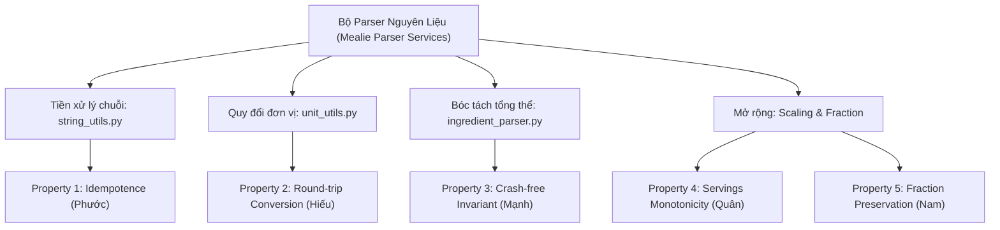

# ĐỀ CƯƠNG KẾ HOẠCH KIỂM THỬ PROPERTY-BASED TESTING (GIỮA KỲ)
## ĐỒ ÁN MÔN KIỂM THỬ PHẦN MỀM — NHÓM 6
* **Hệ thống mục tiêu (R02):** [Mealie v3.28.0](https://github.com/mealie-recipes/mealie) (Commit SHA: `0552eaa4a80031b8572849cca0ed95d07f1be001`)
* **Kỹ thuật nâng cao (K01):** Property-Based Testing (PBT) với thư viện `Hypothesis`
* **Người thực hiện:** **Bùi Trung Hiếu** *(MSSV: 2110037 | GitHub: `2312611-Hieu` — Vai trò: Test Architect & PBT Methodology Specialist)*
* **Đối tượng tiếp nhận:** Trưởng nhóm **Trần Quốc Quân** *(tổng hợp vào Báo cáo Giữa kỳ)*

---

### 1. TỔNG QUAN VỀ PHƯƠNG PHÁP KIỂM THỬ PROPERTY-BASED TESTING (PBT)

#### 1.1. Hạn chế của kiểm thử dựa trên ca mẫu truyền thống (Example-Based Testing)
Kiểm thử dựa trên ví dụ (Example-Based Testing - EBT) chỉ xác minh tính đúng đắn trên một tập hữu hạn các ca kiểm thử do kiểm thử viên dự tính trước (ví dụ: $1 + 1 = 2$, `"1/2 cup" \rightarrow 0.5$). Cách tiếp cận này bộc lộ những điểm yếu:
- **Thiên kiến xác nhận (Confirmation Bias):** Lập trình viên thường chỉ viết test cho các kịch bản mà họ đã nghĩ đến và mã nguồn đã xử lý tốt.
- **Bỏ lọt ca biên (Edge cases):** Các dữ liệu đặc thù như chuỗi Unicode phức tạp, ký tự phân số cổ, dấu ngoặc lồng nhau nhiều cấp, khoảng trắng bất thường rất dễ bị bỏ quên.
- **Chi phí bảo trì cao:** Phải viết hàng chục hàm test tĩnh lặp đi lặp lại chỉ để kiểm tra các biến thể dữ liệu tương tự nhau.

#### 1.2. Bản chất và sức mạnh của Property-Based Testing với Hypothesis
PBT không kiểm tra từng cặp giá trị cụ thể `(Input -> Expected Output)` mà kiểm tra **Tính chất bất biến (Invariants)** mà hàm mục tiêu phải luôn thỏa mãn trên **không gian đầu vào vô hạn**:
$$\forall x \in \text{Domain}, \quad \text{Invariant}(f(x)) = \text{True}$$

Công cụ chính được nhóm lựa chọn là thư viện **Hypothesis** trên nền tảng Python vì 3 năng lực cốt lõi:
1. **Bộ sinh dữ liệu thông minh (Strategies Engine):** Sinh tự động hàng trăm ca kiểm thử với độ bao phủ từ chuỗi rỗng, số 0, số âm, số thực vô tỉ, đến các chuỗi Unicode ngẫu nhiên.
2. **Cơ chế thu nhỏ ca lỗi tự động (Shrinking Mechanism):** Khi tìm thấy một phản ví dụ (counterexample) làm sập hệ thống (ví dụ: một chuỗi 300 ký tự gây crash), Hypothesis sẽ tự động thu hẹp từng bước để tìm ra chuỗi ngắn nhất, tối giản nhất vẫn gây ra lỗi đó, giúp quá trình phân tích nguyên nhân gốc rễ (Root Cause Analysis - RCA) trở nên tức thì.
3. **Cơ chế lọc mẫu và giả định (`assume`):** Lọc bỏ các mẫu không thỏa mãn tiền điều kiện đầu vào của nghiệp vụ mà không làm gián đoạn luồng thực thi.

---

### 2. PHẠM VI KIỂM THỬ TRỌNG TÂM (SCOPE BOUNDARIES)

Tuân thủ nghiêm ngặt **Triết lý Ponytail** (Tối ưu hóa nguồn lực, tập trung vào cốt lõi nghiệp vụ logic thuần túy và không tạo gánh nặng hạ tầng giả lập):

#### 2.1. Module mục tiêu: `mealie/services/parser_services/`
Module này chịu trách nhiệm phân tích văn bản người dùng nhập vào để bóc tách thành các thành phần nguyên liệu nấu ăn, là "cửa ngõ" xử lý dữ liệu phức tạp nhất trong Mealie.

| Tên File | Vai trò nghiệp vụ trong Mealie | Rủi ro tiềm ẩn cần kiểm thử |
| :--- | :--- | :--- |
| `parser_utils/string_utils.py` | Chuẩn hóa chuỗi nguyên liệu, bóc tách dấu sao footnote, đưa ngoặc chú thích về cuối, chuyển đổi phân số Unicode. | Vỡ định dạng chuỗi, treo regex (Catastrophic Backtracking), không bảo toàn tính lũy đẳng qua nhiều lần làm sạch. |
| `parser_utils/unit_utils.py` | Quy đổi qua lại giữa các đơn vị đo lường thể tích và khối lượng dựa trên `Pint`. | Sai số làm tròn dấu phẩy động, mất dữ liệu khi đổi qua lại (Round-trip failure), crash khi gặp đơn vị không tương thích. |
| `ingredient_parser.py` | Lớp `BruteForceParser` bóc tách chuỗi nguyên liệu tổng thể thành số lượng, đơn vị, tên món và ghi chú. | Ném lỗi không kiểm soát (`Unhandled Exception` / HTTP 500) khi gặp dữ liệu người dùng nhập bất thường. |

#### 2.2. Ranh giới loại trừ (Out of Scope)
- Không kiểm thử giao diện Vue Frontend.
- Không kiểm thử các API quản lý người dùng, nhóm gia đình thông thường.
- Không kiểm thử việc ghi dữ liệu vật lý xuống SQLite/PostgreSQL (được cô lập hoàn toàn bằng Mock Fixture).

---

### 3. MA TRẬN 5 KỊCH BẢN KIỂM THỬ PBT (5 CORE PROPERTIES)

Nhóm 6 thiết kế chuẩn hóa 5 tính chất kiểm thử phân công độc lập cho 5 thành viên:

#### Chi tiết 5 Tính chất:

1. **Property 1: Tính lũy đẳng của bộ làm sạch chuỗi (Idempotence Invariant)**
   - *Thành viên phụ trách:* Trần Ngọc Bảo Phước.
   - *Mục tiêu:* Hàm làm sạch chuỗi khi thực hiện một lần hay nhiều lần liên tiếp phải cho cùng kết quả:
     $$f(f(x)) = f(x)$$
   - *Hàm kiểm tra:* `remove_footnote_markers`, `move_parens_to_end`.

2. **Property 2: Tính bảo toàn hai chiều khi quy đổi đơn vị (Round-trip Invariant)**
   - *Thành viên phụ trách:* Bùi Trung Hiếu.
   - *Mục tiêu:* Khi đổi một lượng $Q$ từ đơn vị $A$ sang $B$, sau đó đổi ngược từ $B$ về $A$, kết quả phải tiệm cận giá trị ban đầu với sai số cho phép:
     $$| \text{convert}(\text{convert}(Q, A, B), B, A) - Q | \le \epsilon \quad (\epsilon = 10^{-4})$$
   - *Hàm kiểm tra:* `UnitConverter.convert(quantity, from_unit, to_unit)`.

3. **Property 3: Tính bền vững bất khả sập (Crash-free Invariant)**
   - *Thành viên phụ trách:* Võ Hùng Mạnh.
   - *Mục tiêu:* Hàm phân tích nguyên liệu tổng thể không bao giờ được phép ném ra Unhandled Exception đối với bất kỳ chuỗi ngẫu nhiên nào:
     $$\forall s \in \text{st.text()}, \quad \text{parse\_one}(s) \not\to \text{Crash}$$
   - *Hàm kiểm tra:* `BruteForceParser.parse_one`.

4. **Property 4: Tính đơn điệu khi nhân chia tỉ lệ khẩu phần (Monotonicity & Reversibility)**
   - *Thành viên phụ trách:* Trần Quốc Quân.
   - *Mục tiêu:* Số lượng nguyên liệu sau khi nhân hệ số khẩu phần $k > 1$ phải lớn hơn ban đầu, và việc chia lại cho $k$ phải khôi phục giá trị gốc.

5. **Property 5: Tính bảo toàn giá trị toán học của phân số (Numeric Preservation)**
   - *Thành viên phụ trách:* Nguyễn Phạm Phú Nam.
   - *Mục tiêu:* Bóc tách các dạng phân số (phân số thường, phân số Unicode `½`, `¾`, hỗn số `1 1/2`) sang số thực phải bảo toàn chính xác giá trị toán học.

---

### 4. TIÊU CHÍ ĐÁNH GIÁ VÀ HẠ TẦNG THỰC THI (TEST HARNESS)

#### 4.1. Hệ thống 3 Profiles của Hypothesis
Được cấu hình sẵn trong `tests/conftest.py`:
- **`dev` profile:** $100$ ví dụ ngẫu nhiên — Dành cho lập trình viên chạy kiểm tra nhanh khi code (`pytest`).
- **`ci` profile:** $300$ ví dụ ngẫu nhiên — Dành cho thẩm định chất lượng trước khi tạo Pull Request.
- **`thorough` profile:** $1000$ ví dụ ngẫu nhiên — Dành cho nghiệm thu cuối kỳ và đo độ bao phủ mã nguồn.

#### 4.2. Tiêu chí Pass / Fail
- **PASS:** Toàn bộ các ví dụ sinh ngẫu nhiên thỏa mãn bất biến, không có AssertionError và không phát sinh Unhandled Exception.
- **FAIL:** Hypothesis tìm ra ít nhất một phản ví dụ (Falsifying example). Lúc này Hypothesis kích hoạt Shrinking và cung cấp bộ tham số nhỏ nhất gây lỗi để tiến hành Root Cause Analysis.

#### 4.3. Biện pháp phòng chống Flaky Test (Kiểm thử chập chờn)
1. Cố định cơ số giả ngẫu nhiên qua biến môi trường hoặc tái lập lại qua Seed của Hypothesis: `@reproduce_failure`.
2. Không sử dụng hàm đo thời gian chạy tuyệt đối để tránh ảnh hưởng do cấu hình phần cứng khác nhau.
3. Sai số dấu phẩy động luôn sử dụng ngưỡng sai số dung sai tuyệt đối $\epsilon = 10^{-4}$ thay vì so sánh bằng tuyệt đối `==`.
