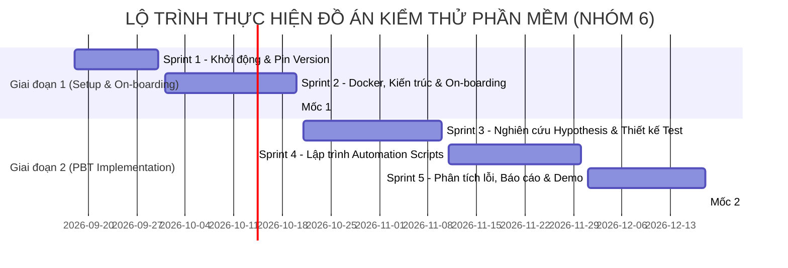

# KẾ HOẠCH LỘ TRÌNH THỰC HIỆN ĐỀ TÀI CUỐI KỲ
## MÔN: KIỂM THỬ PHẦN MỀM - NHÓM 6

* **Đề tài lựa chọn:** Tổ hợp **R02 - K01**
  * **Hệ thống (Repo R02):** [Mealie](https://github.com/mealie-recipes/mealie) (Hệ thống quản lý công thức và lập kế hoạch thực đơn)
  * **Kỹ thuật kiểm thử (K01):** Property-Based Testing (Kiểm thử dựa trên thuộc tính)
  * **Công cụ chủ đạo:** `Hypothesis` (Python) tích hợp cùng `pytest`
* **Giảng viên hướng dẫn:** Nguyễn Thế Lâm
* **Danh sách thành viên Nhóm 6:**
  1. **Trần Quốc Quân** *(Trưởng nhóm / Phụ trách Kiến trúc & Điều phối)*
  2. **Nguyễn Phạm Phú Nam** *(Phụ trách On-boarding & Môi trường DevOps)*
  3. **Bùi Trung Hiếu** *(Phụ trách Nghiên cứu Kỹ thuật PBT & Thiết kế Test)*
  4. **Trần Ngọc Bảo Phước** *(Kỹ sư Tự động hóa Kiểm thử - Automation QA 1)*
  5. **Võ Hùng Mạnh** *(Kỹ sư Tự động hóa Kiểm thử & Phân tích Lỗi - Automation QA 2)*

---

## 🗺️ TỔNG QUAN LỘ TRÌNH & CÁC CỘT MỐC (MILESTONES)

---

## 📍 CHI TIẾT GIAI ĐOẠN 1: PHÂN TÍCH HỆ THỐNG VÀ THIẾT LẬP MÔI TRƯỜNG
> **Mục tiêu:** Đóng vai trò là đội ngũ QA tiếp nhận dự án mới (on-boarding), dựng hệ thống chạy thành công, hiểu sâu kiến trúc và lập đề cương kiểm thử.  
> **Thời hạn hoàn thành:** **20/10** (Báo cáo Giữa kỳ).

### 🔹 Sprint 1: Khởi động & Cố định phiên bản (18/9 – 30/9)
* **Mục tiêu:** Hoàn thiện thủ tục đăng ký, thiết lập kênh làm việc và cố định phiên bản mã nguồn.
* **Các công việc cụ thể:**
  1. **Cố định phiên bản Mealie (Pin Version):**
     * Chọn phiên bản ổn định: Release Tag **`v3.28.0`** (Commit SHA: `0552eaa4a80031b8572849cca0ed95d07f1be001`).
     * Không chạy theo nhánh `mealie-next` để tránh tình trạng mã nguồn thay đổi giữa kỳ làm vỡ môi trường test.
  2. **Thiết lập công cụ quản lý:**
     * Tạo bảng Kanban (Trello/Jira/GitHub Projects) để phân rã task.
     * Thiết lập quy ước Git: nhánh `main` (chính), nhánh `develop`, các nhánh tính năng `feat/*` và quy ước commit atomic.
  3. **Thống nhất nội bộ quy tắc dự án:** Phổ biến tài liệu `Documents/quy_tac_du_an.md` cho toàn bộ thành viên.

### 🔹 Sprint 2: On-boarding, Phân tích Kiến trúc & Chuẩn bị Báo cáo Giữa kỳ (01/10 – 20/10)
* **Mục tiêu:** Cài đặt Mealie thành công trên máy tính, chạy được 3-5 nghiệp vụ và nộp Báo cáo Giữa kỳ.
* **Các công việc cụ thể:**
  1. **Thiết lập môi trường chạy (Docker & Local):**
     * Dựng hệ thống qua `docker-compose.yml` gồm backend FastAPI, frontend Vue, CSDL SQLite/PostgreSQL.
     * Tạo dữ liệu mẫu (**Seed Data**): Người dùng kiểm thử, 5-10 công thức mẫu (recipes) có cấu trúc phức tạp.
  2. **Soạn thảo tài liệu On-boarding (Phần C):**
     * Hướng dẫn cài đặt từ máy sạch (môi trường runtime, biến môi trường `.env`, cổng mạng, lệnh chạy).
     * Bằng chứng nghiệm thu: Chụp ảnh/quay clip hệ thống hoạt động ổn định với ít nhất 3 nghiệp vụ:
       - *Nghiệp vụ 1:* Tạo và phân tích công thức (Recipe creation & Ingredient parsing).
       - *Nghiệp vụ 2:* Quy đổi đơn vị và nhân chia tỉ lệ khẩu phần (Servings scaling & Unit conversion).
       - *Nghiệp vụ 3:* Lên lịch thực đơn theo ngày/tuần (Meal Planner).
  3. **Phân tích Kiến trúc hệ thống (Phần A & B):**
     * Vẽ sơ đồ kiến trúc tổng thể (C4 model / Container diagram).
     * Xác định 3-5 module liên quan mật thiết đến kiểm thử: `mealie/services/parser_services/`, `mealie/schema/recipe/`, `mealie/services/recipe/`.
  4. **Xây dựng Đề cương Kỹ thuật K01:**
     * Trình bày phạm vi kiểm thử (chọn module phân tích nguyên liệu làm trọng tâm).
     * Đưa ra các giả định kỹ thuật, tiêu chí Pass/Fail sơ bộ.
* 🎯 **Bàn giao mốc 20/10 (Deliverables Milestone 2):**
  * Slide báo cáo giữa kỳ.
  * Demo trực tiếp hệ thống Mealie chạy local/docker.
  * Tài liệu On-boarding + Sơ đồ kiến trúc + Kế hoạch kiểm thử.

---

## 📍 CHI TIẾT GIAI ĐOẠN 2: ỨNG DỤNG KỸ THUẬT KIỂM THỬ NÂNG CAO (K01)
> **Mục tiêu:** Nghiên cứu lý thuyết Property-Based Testing, dùng Hypothesis thiết kế và lập trình các test script tự động, tìm kiếm phản ví dụ (counterexamples/lỗi) hoặc chứng minh độ bao phủ.  
> **Thời hạn hoàn thành:** **Tháng 12** (Bảo vệ Cuối kỳ).

### 🔹 Sprint 3: Nghiên cứu Chuyên sâu Hypothesis & Thiết kế Test Scenarios (21/10 – 10/11)
* **Mục tiêu:** Nắm vững thư viện Hypothesis và hoàn thiện bảng thiết kế kịch bản kiểm thử (Test Model / Scenarios).
* **Các công việc cụ thể:**
  1. **Nghiên cứu cơ sở lý thuyết Property-Based Testing (Phần D):**
     * Bản chất của PBT: Kiểm tra tính chất phổ quát (Invariants) trên không gian dữ liệu rộng lớn.
     * Cơ chế `Strategies` sinh dữ liệu và cơ chế `Shrinking` (thu nhỏ ca lỗi tự động).
  2. **Thiết kế tối thiểu 03 Properties cốt lõi (Phần E):**
     * **Property 1: Tính lũy đẳng (Idempotence)**
       * *Mục tiêu:* Hàm tiền xử lý chuỗi và tách footnote `remove_footnote_markers(s)` khi chạy liên tiếp 2 lần phải giữ nguyên kết quả: $f(f(x)) == f(x)$.
     * **Property 2: Tính bảo toàn hai chiều (Round-trip / Reversibility)**
       * *Mục tiêu:* Quy đổi đơn vị (ví dụ: Gram $\rightarrow$ Kilogram $\rightarrow$ Gram) hoặc nhân tỉ lệ khẩu phần ăn $k \times S$ sau đó chia lại cho $k$ phải bảo toàn giá trị ban đầu trong sai số dấu phẩy động $\epsilon \le 10^{-4}$.
     * **Property 3: Tính bền bỉ / Bất khả sập (Crash-free Invariant / Robustness)**
       * *Mục tiêu:* Hàm `ingredient_parser.parse_one(text)` không bao giờ được phát sinh lỗi sập hệ thống (Unhandled Exception / 500 error) đối với bất kỳ chuỗi Unicode ngẫu nhiên nào sinh ra từ `st.text()`.
     * *(Mở rộng - Property 4):* Tính đơn điệu (Monotonicity) khi scale số phần ăn.
  3. **Xác định các Hypothesis Strategies:**
     * Thiết kế bộ sinh dữ liệu hỗn hợp: chuỗi ký tự lạ, phân số unicode (`½`, `¼`), số âm, số 0, số thực cực lớn.

### 🔹 Sprint 4: Lập trình Bộ Kiểm Thử Tự Động (Automation Scripts) (11/11 – 30/11)
* **Mục tiêu:** Hiện thực hóa các kịch bản kiểm thử thành mã nguồn Python có thể chạy tự động.
* **Các công việc cụ thể:**
  1. **Xây dựng Test Harness (Phần F):**
     * Tích hợp `hypothesis` vào test runner `pytest` trong repo.
     * Cấu hình tham số kiểm thử: số lượng test runs (ví dụ `max_examples=500`), cấu hình lưu cache kết quả `.hypothesis`.
  2. **Viết mã kiểm thử:**
     * `tests/unit_tests/test_pbt_string_utils.py`: Hiện thực Property 1 & Property 3.
     * `tests/unit_tests/test_pbt_unit_converter.py`: Hiện thực Property 2 (Round-trip đơn vị).
     * `tests/unit_tests/test_pbt_ingredient_parser.py`: Hiện thực PBT cho bộ phân tích nguyên liệu hoàn chỉnh.
  3. **Tự động hóa & Khả năng tái lập:**
     * Viết file hướng dẫn `tests/README.md` chỉ với 1 lệnh: `pytest tests/unit_tests/test_pbt_*.py`.

### 🔹 Sprint 5: Phân tích Lỗi, Báo cáo Tổng kết & Luyện tập Thuyết trình (01/12 – Ngày Bảo Vệ)
* **Mục tiêu:** Thu thập kết quả thực thi, phân tích nguyên nhân cốt lõi (RCA) nếu có bug, đóng gói báo cáo và sẵn sàng bảo vệ.
* **Các công việc cụ thể:**
  1. **Thu thập Log/Metrics & Phân tích Lỗi (Phần G):**
     * Trích xuất các phản ví dụ (Falsifying counterexamples) mà Hypothesis tìm ra.
     * Thực hiện **Root Cause Analysis (RCA)**: Giải thích chi tiết tại sao đoạn code trong Mealie lại bị lỗi (do regex không xử lý chuỗi rỗng, lỗi tràn số, hay lỗi phân số).
     * Đề xuất bản vá (Patch/Pull Request) sửa lỗi cho Mealie.
     * Nếu không phát hiện lỗi: Chạy đo độ bao phủ (Code Coverage) bằng `pytest-cov` để chứng minh độ tin cậy.
  2. **Hoàn thiện Khung Báo cáo 8 phần (A $\rightarrow$ H) (Phần H):**
     * Rà soát toàn bộ báo cáo từ Phần A đến Phần H theo đúng quy chuẩn đề cương.
     * Đóng gói mã nguồn, ghim mã commit SHA, xuất file PDF báo cáo (nộp trước ngày bảo vệ 1 tuần).
  3. **Chuẩn bị Thuyết trình & Demo:**
     * Soạn Slide thuyết trình chuyên nghiệp.
     * Tập dượt kịch bản demo: Chạy live script `pytest` hiển thị kết quả Hypothesis sinh ca test và tìm lỗi.
     * Thực hiện đánh giá chéo thành viên (Peer-review).

---

## 👥 MA TRẬN PHÂN CÔNG TRÁCH NHIỆM (RACI MATRIX)

* **R (Responsible):** Người trực tiếp làm chính.
* **A (Accountable):** Người chịu trách nhiệm phê duyệt và chất lượng cuối cùng.
* **C (Consulted):** Người được hỏi ý kiến, phối hợp chuyên môn.
* **I (Informed):** Người nhận thông tin tiến độ.

| Hạng mục công việc | Mốc / Phần | Quân (Lead) | Nam (DevOps) | Hiếu (PBT) | Phước (QA 1) | Mạnh (QA 2) |
| :--- | :---: | :---: | :---: | :---: | :---: | :---: |
| **Quản trị Sprint & Quy tắc Git** | Sprint 1 | **A / R** | I | C | C | C |
| **Cố định Commit SHA & Pin Tag v3.28.0** | Sprint 1 (H) | **A / R** | C | I | I | I |
| **Dựng Docker Compose & Seed Data** | Sprint 2 (C) | A | **R** | C | C | C |
| **Tài liệu On-boarding & Bằng chứng chạy** | Sprint 2 (C) | A | **R** | I | I | I |
| **Phân tích Kiến trúc & Luồng dữ liệu** | Sprint 2 (A, B) | **R** | C | C | I | I |
| **Kế hoạch & Báo cáo Giữa kỳ (20/10)** | Milestone 2 | **A / R** | R | R | R | R |
| **Nghiên cứu lý thuyết Hypothesis & PBT** | Sprint 3 (D) | C | I | **A / R** | C | C |
| **Thiết kế $\ge 3$ Properties & Scenarios** | Sprint 3 (E) | C | I | **A / R** | R | R |
| **Viết Script Automation Property 1 (Idempotence)** | Sprint 4 (F) | C | I | C | **A / R** | C |
| **Viết Script Automation Property 2 (Round-trip)** | Sprint 4 (F) | C | I | **A / R** | C | C |
| **Viết Script Automation Property 3 (Crash-free)** | Sprint 4 (F) | C | I | C | C | **A / R** |
| **Viết Script Automation Property 4 (Scaling)** | Sprint 4 (F) | **A / R** | I | C | C | C |
| **Viết Script Automation Property 5 & Docker Test** | Sprint 4 (F) | C | **A / R** | C | C | C |
| **Xây dựng Test Harness & Hướng dẫn (README)** | Sprint 4 (F, H) | A | C | I | **A / R** | R |
| **Chạy test, Log/Metrics & Đo Coverage** | Sprint 5 (G) | A | I | C | R | **A / R** |
| **Phân tích lỗi (Root Cause Analysis - RCA)** | Sprint 5 (G) | C | I | C | C | **A / R** |
| **Tổng hợp Báo cáo 8 phần (A - H)** | Sprint 5 | **A / R** | C | C | C | C |
| **Slide & Kịch bản Demo Bảo vệ Cuối kỳ** | Milestone Final | **A / R** | R | R | R | R |

---

## 🎯 BẢNG KIỂM TRA CHẤT LƯỢNG ĐẦU RA (QUALITY GATES)

| Cột mốc | Tiêu chí đạt chuẩn để nghiệm thu | Người nghiệm thu |
| :--- | :--- | :---: |
| **Cổng 1 (20/10)** | • Mealie chạy mượt trên Docker/Local có sẵn dữ liệu mẫu. • Tài liệu on-boarding viết chi tiết, người khác làm theo chạy được ngay. • Có sơ đồ kiến trúc và xác định rõ 3-5 module liên quan. • Kế hoạch kiểm thử PBT rõ ràng về phạm vi. | Quân (Lead) |
| **Cổng 2 (30/11)** | • Mã test Python tích hợp trơn tru với `pytest`. • Tối thiểu 3 Properties chạy được tự động, sinh hàng trăm test cases. • Cơ chế Shrinking hoạt động đúng khi gặp phản ví dụ. • File `README.md` cung cấp lệnh chạy 1-click. | Hiếu & Phước |
| **Cổng 3 (Bảo vệ)** | • Đầy đủ Báo cáo tổng kết 8 phần A-H không thiếu mục nào. • Chỉ ra được ít nhất 1 lỗi thực tế hoặc phân tích sâu coverage đạt chuẩn. • Cả 5 thành viên đều có lịch sử commit Git đồng đều. • Slide thuyết trình đẹp, phân vai báo cáo rành mạch. | Toàn nhóm 6 |
